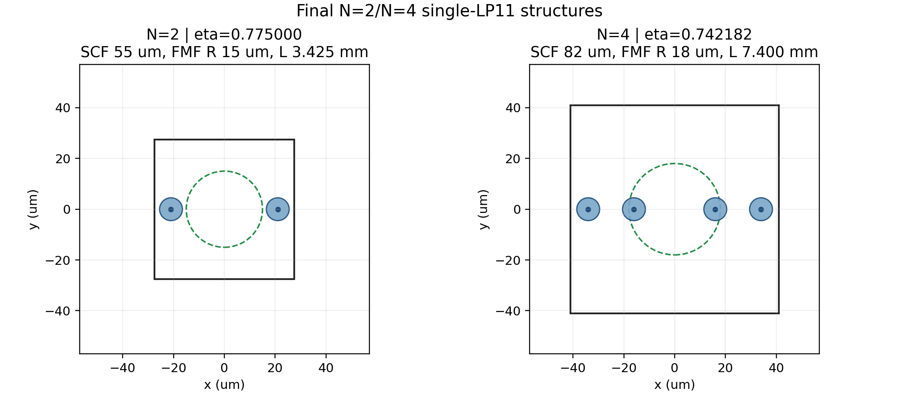
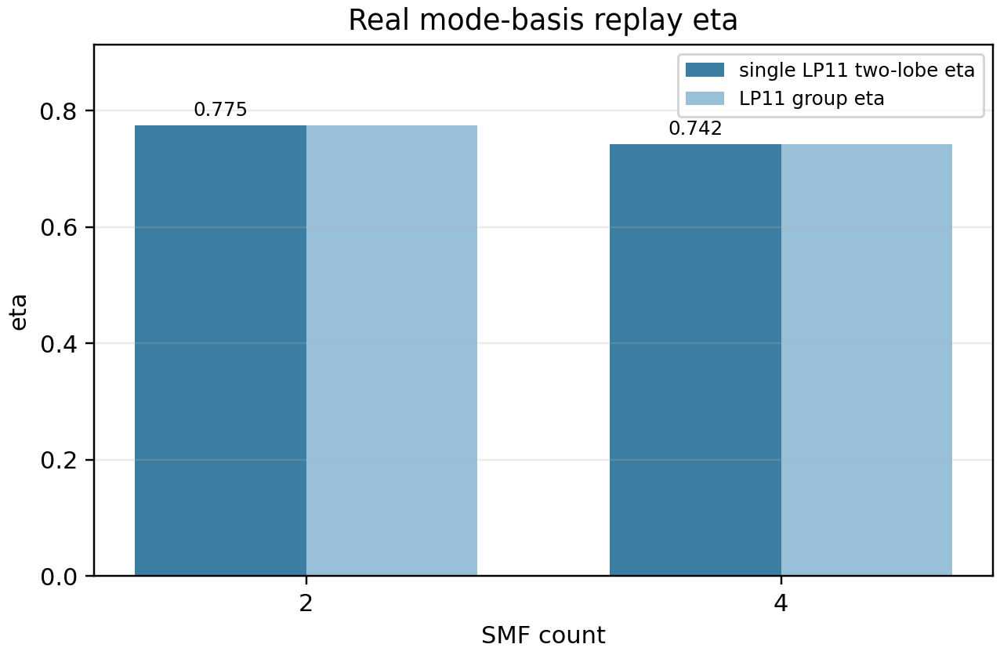
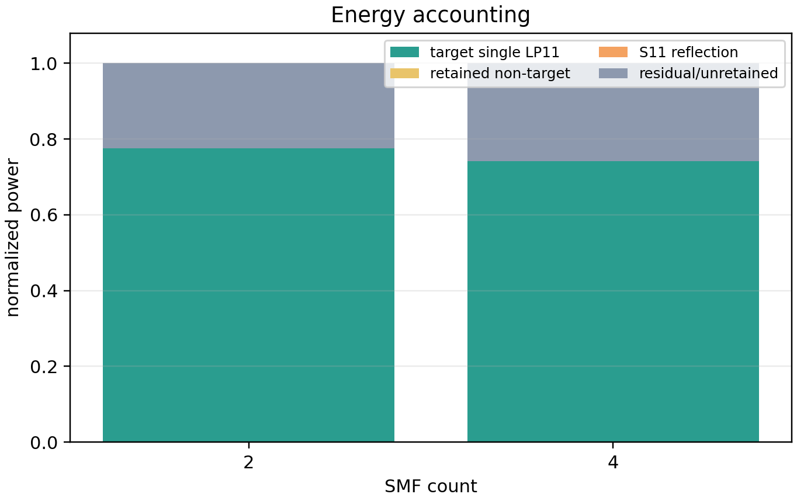
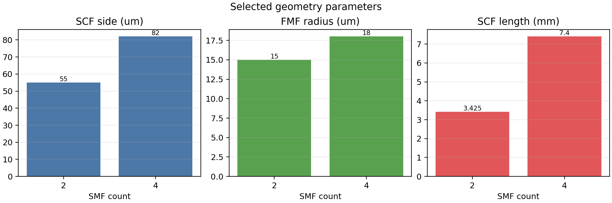
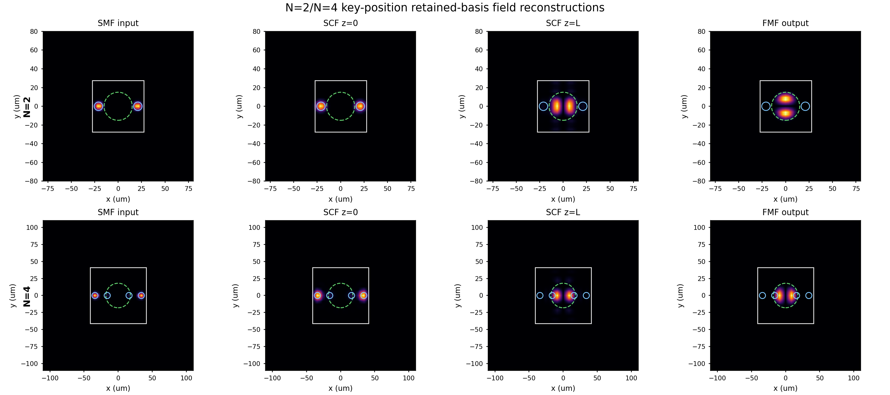
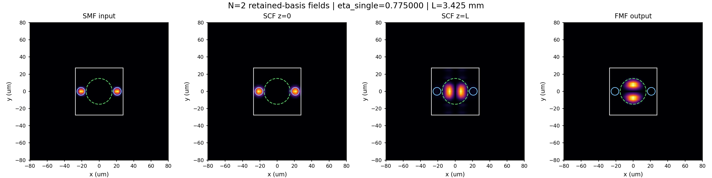
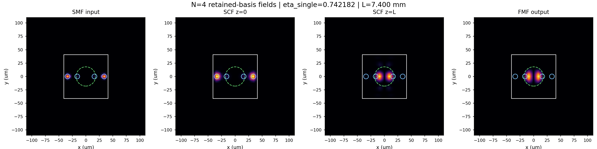
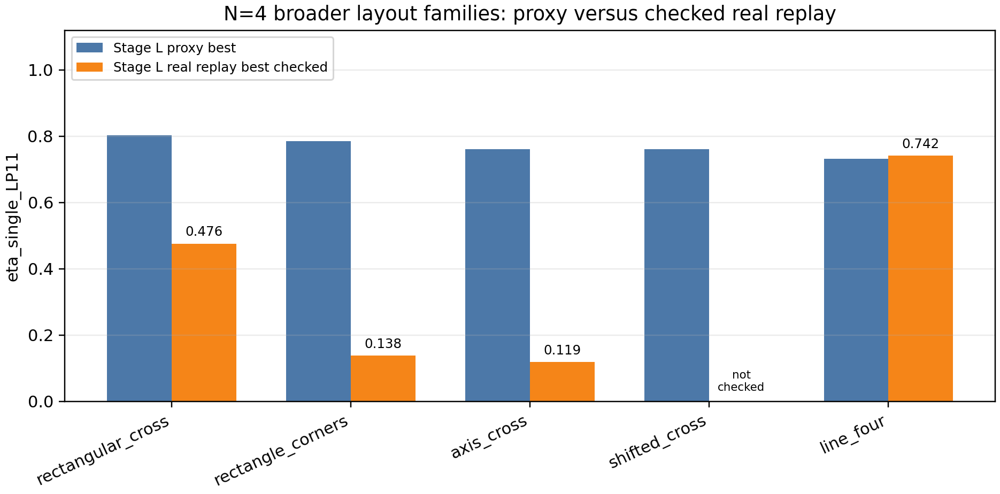
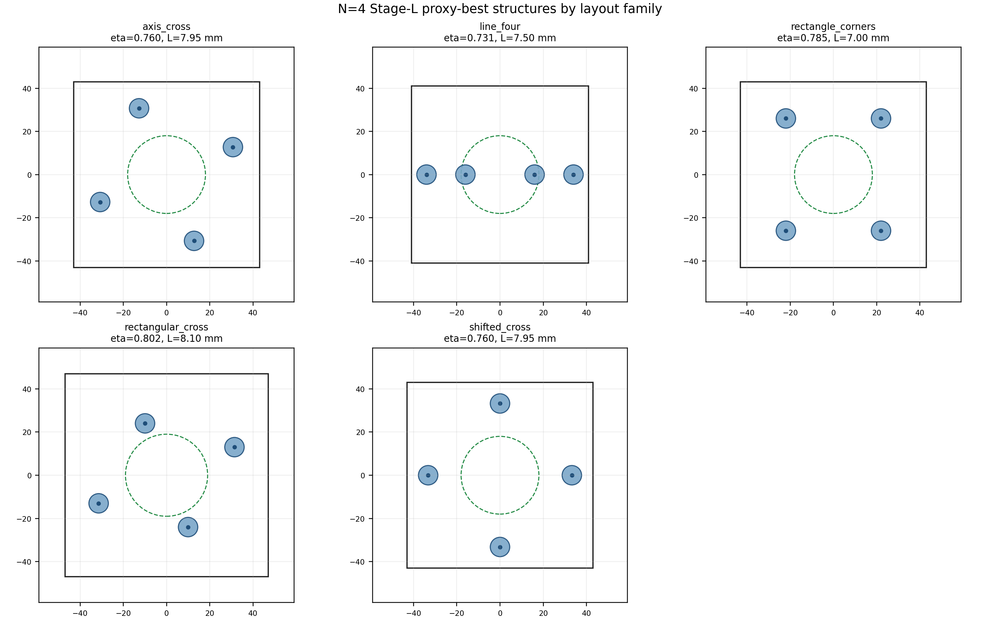

# N=2 and N=4 Single-LP11 Final Report

This report summarizes the current best real mode-basis replay evidence for the N=2 and N=4 single canonical LP11 two-lobe target search. It is not a full-count conclusion; N=6/8/10 are not included here.

Field panels are retained-basis reconstructions from saved real SMF FDE modes, EME SCF/FMF port bases, and solved EME S-matrix sidecars. They are not new Lumerical monitor exports.

## Selected Results

| N | eta_single_LP11 | eta_LP11_group | single/group | target | SCF side (um) | FMF R (um) | SMF R (um) | L (mm) | layout | positions (um) |
|---:|---:|---:|---:|---|---:|---:|---:|---:|---|---|
| 2 | 0.775000 | 0.775000 | 1.000000 | LP11y-polY | 55 | 15 | 4.5 | 3.425 | best_local_axis_pair | `-21,0;21,0` |
| 4 | 0.742182 | 0.742182 | 1.000000 | LP11x-polY | 82 | 18 | 4.5 | 7.400 | line_four | `-34,0;-16,0;16,0;34,0` |

## Key Figures









## Key-Position Mode/Field Panels

Each row shows `SMF input | SCF z=0 | SCF z=L | FMF output` for the selected single-LP11 optimum.







## Field Reconstruction Diagnostics

| N | source eta | reconstructed eta | abs error | target | two-lobe gate | convention |
|---:|---:|---:|---:|---|---|---|
| 2 | 0.775000 | 0.775000 | 0.000e+00 | LP11y-polY | True | retained-basis reconstruction; SCF z=L is phase propagation for visualization; eta uses S21 @ normalized SCF z=0 coefficients |
| 4 | 0.742182 | 0.742182 | 0.000e+00 | LP11x-polY | True | retained-basis reconstruction; SCF z=L is phase propagation for visualization; eta uses S21 @ normalized SCF z=0 coefficients |

## N=4 Broader Layout Family Audit

Stage L screened five N=4 layout families: `axis_cross`, `rectangular_cross`, `rectangle_corners`, `shifted_cross`, and `line_four`. The table below separates proxy best candidates from real replay evidence because the proxy ranking did not predict the final SMF-limited real replay ordering.





### Stage L Proxy Best by Family

| family | eta proxy | eta group proxy | target | SCF | FMF R | L mm | pitch/parameter | rotation | positions |
|---|---:|---:|---|---:|---:|---:|---:|---:|---|
| rectangular_cross | 0.802309 | 0.813701 | LP11x-polX | 94 | 19 | 8.100 | 42.802 | 22.500 | `-31.4119,-13.0112;31.4119,13.0112;9.94977,-24.0209;-9.94977,24.0209` |
| rectangle_corners | 0.784642 | 0.810580 | LP11y-polY | 86 | 18 | 7.000 | 44.000 | 0.000 | `-22,-26;22,-26;-22,26;22,26` |
| axis_cross | 0.760373 | 0.771169 | LP11y-polY | 86 | 18 | 7.950 | 47.000 | 22.500 | `-30.7042,-12.7181;30.7042,12.7181;12.7181,-30.7042;-12.7181,30.7042` |
| shifted_cross | 0.760373 | 0.785509 | LP11y-polY | 86 | 18 | 7.950 | 47.000 | 0.000 | `-33.234,0;33.234,0;0,-33.234;0,33.234` |
| line_four | 0.731260 | 0.755434 | LP11x-polX | 82 | 18 | 7.500 | 18.000 | 0.000 | `-34,0;-16,0;16,0;34,0` |

### Stage L Real Replay Best by Checked Family

| family | eta real replay | proxy eta for same row | target | SCF | FMF R | L mm | pitch/parameter | rotation | note |
|---|---:|---:|---|---:|---:|---:|---:|---:|---|
| line_four | 0.741634 | 0.731260 | LP11x-polY | 82 | 18 | 7.500 | 18.000 | 0.000 | checked real sidecar |
| rectangular_cross | 0.476081 | 0.802309 | LP11x-polY | 90 | 19 | 8.100 | 42.802 | 0.000 | checked real sidecar |
| rectangle_corners | 0.137893 | 0.784642 | LP11x-polX | 86 | 18 | 7.000 | 44.000 | 0.000 | checked real sidecar |
| axis_cross | 0.118915 | 0.760373 | LP11x-polX | 86 | 18 | 7.950 | 47.000 | 22.500 | checked real sidecar |
| shifted_cross |  |  |  |  |  |  |  |  | not included in Stage L top-diverse real replay |

### Follow-Up Real Replay Best Rows

| source | family | eta real replay | proxy eta for same row | target | SCF | FMF R | L mm | parameter | positions |
|---|---|---:|---:|---|---:|---:|---:|---:|---|
| Stage M line-four local real replay | line_four | 0.742182 | 0.759690 | LP11x-polY | 82 | 18 | 7.400 | 18.000 | `-34,0;-16,0;16,0;34,0` |
| Stage K cross local real replay | stage_k_n4_cross | 0.728533 | 0.692767 | LP11x-polX | 86 | 18 | 7.950 | 47.000 | `-33.234,0;33.234,0;0,-33.234;0,33.234` |
| N4 historical cross anchor real replay | historical_n4_cross | 0.713382 | 0.646994 | LP11y-polY | 86 | 18 | 7.860 | 46.000 | `-32.5269,0;32.5269,0;0,-32.5269;0,32.5269` |

Main readout: rectangular/corner/cross families looked strong in proxy (`~0.76-0.80`), but the checked real replay rows dropped strongly. The line-four family replayed best so far: Stage L `0.741634`, then Stage M refined it to `0.742182`. The best locally refined centered-cross follow-up is `0.728533`, close but still below line-four.

## Interpretation Boundary

- The N=2 best checked row is slightly higher than the current N=4 best checked row.
- This does not prove that fewer cores are universally better; it only summarizes the currently completed N=2/N=4 real replay branches.
- The field panels are explanatory. The quantitative evidence remains the eta, target dominance, and energy ledger tables.

## Machine-Readable Summary

```json
{
  "ok": true,
  "status": "n2_n4_single_lp11_report_generated",
  "smf_counts": [
    2,
    4
  ],
  "best_eta_by_count": {
    "2": 0.7750002096014241,
    "4": 0.7421820139163451
  },
  "n4_family_audit": {
    "proxy_best_count": 5,
    "stage_l_real_replay_best_count": 4,
    "followup_real_replay_best_count": 3,
    "best_stage_l_proxy_family": "rectangular_cross",
    "best_stage_l_real_checked_family": "line_four",
    "best_followup_real_family": "line_four"
  },
  "field_reconstruction_status": "retained_basis_reconstruction_completed",
  "claim_boundary": "Current N=2/N=4 single-LP11 real mode-basis replay summary only; not a full N-trend or fabricated-device conclusion.",
  "files": {
    "selected_rows": "Demo for user/2026-05-31_single_lp11_n2_n4_final_report/results/n2_n4_single_lp11_report/sweeps/n2_n4_selected_rows.csv",
    "energy": "Demo for user/2026-05-31_single_lp11_n2_n4_final_report/results/n2_n4_single_lp11_report/sweeps/n2_n4_energy.csv",
    "field_diagnostics": "Demo for user/2026-05-31_single_lp11_n2_n4_final_report/results/n2_n4_single_lp11_report/sweeps/n2_n4_field_reconstruction_diagnostics.csv",
    "controls": "Demo for user/2026-05-31_single_lp11_n2_n4_final_report/results/n2_n4_single_lp11_report/sweeps/n2_n4_controls_reconstructed.csv",
    "n4_stage_l_family_best_proxy": "Demo for user/2026-05-31_single_lp11_n2_n4_final_report/results/n2_n4_single_lp11_report/sweeps/n4_stage_l_family_best_proxy.csv",
    "n4_stage_l_family_best_real_replay": "Demo for user/2026-05-31_single_lp11_n2_n4_final_report/results/n2_n4_single_lp11_report/sweeps/n4_stage_l_family_best_real_replay.csv",
    "n4_followup_family_best_real_replay": "Demo for user/2026-05-31_single_lp11_n2_n4_final_report/results/n2_n4_single_lp11_report/sweeps/n4_followup_family_best_real_replay.csv",
    "report": "Demo for user/2026-05-31_single_lp11_n2_n4_final_report/results/n2_n4_single_lp11_report/reports/n2_n4_single_lp11_report.md",
    "figures": {
      "structures": "Demo for user/2026-05-31_single_lp11_n2_n4_final_report/results/n2_n4_single_lp11_report/figures/optimized_structures_n2_n4.png",
      "eta": "Demo for user/2026-05-31_single_lp11_n2_n4_final_report/results/n2_n4_single_lp11_report/figures/eta_single_lp11_n2_vs_n4.png",
      "energy": "Demo for user/2026-05-31_single_lp11_n2_n4_final_report/results/n2_n4_single_lp11_report/figures/energy_accounting_n2_vs_n4.png",
      "geometry": "Demo for user/2026-05-31_single_lp11_n2_n4_final_report/results/n2_n4_single_lp11_report/figures/geometry_parameters_n2_vs_n4.png",
      "n4_family_proxy_vs_real": "Demo for user/2026-05-31_single_lp11_n2_n4_final_report/results/n2_n4_single_lp11_report/figures/n4_layout_family_proxy_vs_real.png",
      "n4_family_proxy_structures": "Demo for user/2026-05-31_single_lp11_n2_n4_final_report/results/n2_n4_single_lp11_report/figures/n4_stage_l_proxy_best_family_structures.png",
      "field_N2": "Demo for user/2026-05-31_single_lp11_n2_n4_final_report/results/n2_n4_single_lp11_report/figures/field_panels_N2.png",
      "field_N4": "Demo for user/2026-05-31_single_lp11_n2_n4_final_report/results/n2_n4_single_lp11_report/figures/field_panels_N4.png",
      "field_contact": "Demo for user/2026-05-31_single_lp11_n2_n4_final_report/results/n2_n4_single_lp11_report/figures/field_panels_N2_N4_contact_sheet.png"
    },
    "summary_json": "Demo for user/2026-05-31_single_lp11_n2_n4_final_report/results/n2_n4_single_lp11_report/data/n2_n4_single_lp11_report_summary.json"
  }
}
```
